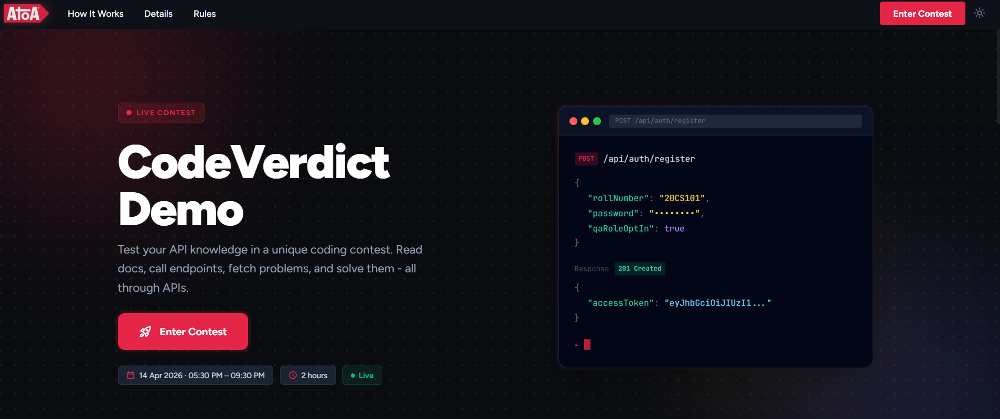
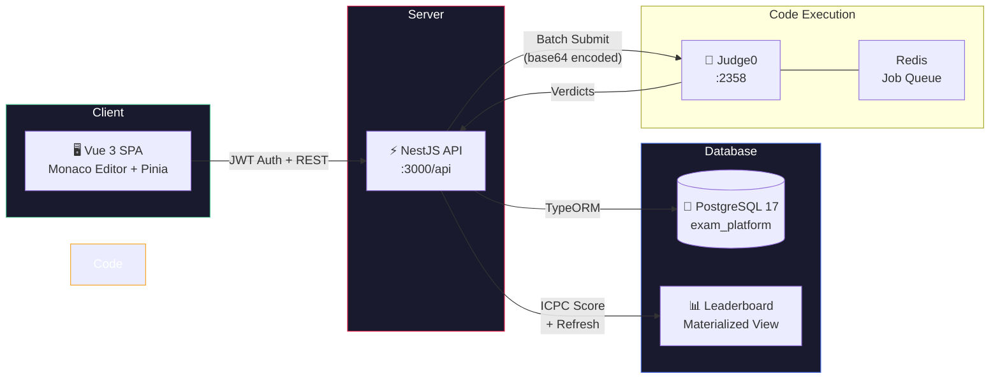

# ✨ CodeVerdict - Open-Source Coding Exam Platform

<p align="center">
  
</p>

[](https://railway.com/deploy/YzG0Rg?referralCode=6wo8jP&utm_medium=integration&utm_source=template&utm_campaign=generic)


**Self-host your own coding exam platform** with live leaderboards, ICPC scoring, and instant code execution. CodeVerdict is a production-grade, open-source online coding examination platform built with NestJS, Vue 3, and PostgreSQL. Students solve programming problems in a Monaco-powered editor, get instant multi-test-case feedback via a self-hosted Judge0 executor, and compete on a real-time ICPC-scored leaderboard. Administrators create and manage exams, problems, and test cases through a dedicated panel.

**🚀 Battle-tested in production:** 90,000+ requests handled in a 2-hour exam window with just 2 replicas - 99.99% success rate (9 failures out of 90,200 requests). 120+ concurrent users taking exams simultaneously.

Fully open-source (AGPL-3.0) and white-label ready - customize branding (logo, app name, colors, copyright) via environment variables. No code changes needed.

> **Open-source alternative to HackerRank, CodeSignal, HackerEarth, LeetCode, Codility, TestDome, CoderPad, CodeChef, and Codeforces.** CodeVerdict gives you full control - self-host on your own infrastructure, own your data, white-label everything, and pay nothing.

## Preview

<p align="center">
  
</p>

> **Student Portal** - Landing page once an exam is configured and live. Students see the contest details, rules, and timing at a glance. Hit **Enter Contest** to register via the API and jump straight into the coding environment.

---

## Features

- **Multiple concurrent exams** - run several exams simultaneously with an exam selector
- **Server-synced timer** - countdown uses server time, preventing client-side manipulation
- **Monaco editor** - VSCode-quality code editor with syntax highlighting
- **Instant feedback** - test cases run via Judge0 batch API; per-case verdicts returned
- **Run mode** - execute code against sample inputs without scoring
- **MCQ support** - mixed exam formats with coding + multiple-choice
- **ICPC scoring** - penalty-based scoring, race-condition-safe via database write locks
- **Live leaderboard** - materialized view, refreshed after every accepted submission
- **Autosave** - code drafts debounce-saved to the server
- **Admin panel** - create exams, duplicate them, manage problems and test cases
- **White-label branding** - app name, logo, colors, copyright - all via env vars
- **Swagger docs** - full OpenAPI docs at `/api-docs` in development
- **Brotli pre-compression** - `.br` assets generated at build time via Vite plugin

---

## Architecture



| Layer | Tech |
|-------|------|
| Frontend | Vue 3, Vite 8, Pinia, Monaco Editor, TypeScript |
| Backend | NestJS 11, TypeORM, Passport JWT, Swagger |
| Database | PostgreSQL 17, Redis (Judge0 queue) |
| Infra | Docker Compose, Node 22-alpine, Judge0 1.13.1 |

---

## Quick Start

### Docker (recommended)

```bash
git clone https://github.com/ATOAPaymentsLimited/CodeVerdict.git
cd CodeVerdict
cp .env.example .env         # set DB_PASSWORD, JWT_SECRET, ADMIN_SETUP_KEY
docker compose up --build    # → http://localhost:3000
```

### Local development

```bash
# Install
cd server && npm install && cd ../client && npm install && cd ..

# Configure
cp server/.env.example server/.env    # fill in values
cp client/.env.example client/.env    # optional branding

# Run
cd server && npm run start:dev        # → http://localhost:3000
cd client && npm run dev              # → http://localhost:5173 (separate terminal)
```

> Set `CORS_ORIGIN=http://localhost:5173` in `server/.env` when running client and server separately.

> **Tip:** Generate a secure `JWT_SECRET` with:
> ```bash
> node -e "console.log(require('crypto').randomBytes(48).toString('hex'))"
> ```

---

## Environment Variables

All variables are documented in the `.env.example` files:

| File | Purpose |
|------|---------|
| `.env.example` | Docker Compose - database, JWT, Judge0, admin key |
| `server/.env.example` | Local dev - same as above + host/port config |
| `client/.env.example` | Branding - app name, logo, colors, copyright |

Key required variables: `DB_PASSWORD`, `JWT_SECRET`, `ADMIN_SETUP_KEY`, `JUDGE0_URL`

---

## Branding & Customization

The platform is fully white-label. No code changes needed:

1. **Logo** - drop into `client/public/`, set `VITE_LOGO_PATH`
2. **App name** - set `VITE_APP_NAME` + `APP_NAME`
3. **Colors** - set `VITE_PRIMARY_COLOR` and `VITE_ACCENT_COLOR` (hex)
4. **Copyright** - set `VITE_COPYRIGHT_HOLDER`

---

## Deploy to Railway

[](https://railway.com/deploy/YzG0Rg?referralCode=6wo8jP&utm_medium=integration&utm_source=template&utm_campaign=generic)

Railway provisions the app and PostgreSQL automatically. Set `JWT_SECRET`, `ADMIN_SETUP_KEY`, and `JUDGE0_URL` during deploy.

> **Post-deployment:** If you serve the frontend from a different domain, set `CORS_ORIGIN` to that domain. Otherwise leave it blank.

**Judge0** requires privileged Docker containers, so it must be deployed separately:
1. **Self-host** on a VPS - [Judge0 docs](https://github.com/judge0/judge0)
2. **Hosted API** via [RapidAPI](https://rapidapi.com/judge0-official/api/judge0-ce)

---

## Production Build

```bash
docker build -t codeverdict:latest .
```

Multi-stage Dockerfile: builds Vue SPA (with Brotli pre-compression) → compiles NestJS → copies both into a minimal `node:22-alpine` image running as non-root.

---

## Contributing

Contributions are welcome! 🎉 See [CONTRIBUTING.md](CONTRIBUTING.md) for setup, coding standards, commit conventions, and the PR process.

---

## License

**GNU Affero General Public License v3.0 (AGPL-3.0)** - see [LICENSE](LICENSE).

| What you **can** do | What you **must** do |
|---------------------|----------------------|
| ✅ Use for any purpose (commercial or academic) | 📤 Share source code of modifications |
| ✅ Modify and customize freely | 📤 Provide source access to network users (SaaS/hosted) |
| ✅ Distribute copies | 📄 Keep the same AGPL-3.0 license on derivatives |
| ✅ Self-host for your institution | 📝 State changes you made |

**In plain terms:**
- **Universities and schools** - self-host freely, customize branding, no cost ever.
- **Companies running it as a service** - you must open-source your modifications.
- **Contributors** - your work stays open and can never be taken proprietary.

